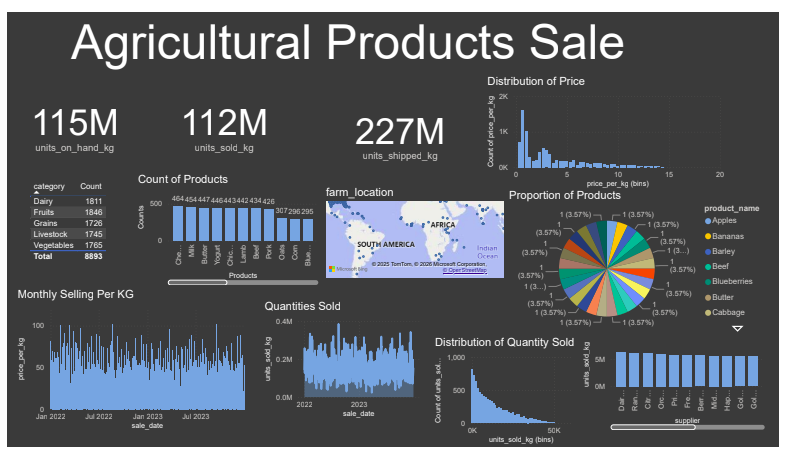

# Agricultural-Products-Sale
Power BI dashboard
# Agricultural Products Sales Analysis – Power BI Project

## Project Overview

Agricultural economics plays an important role in understanding how agricultural resources are produced, distributed, and consumed within the global economy. Agriculture supports food security, employment, economic development, and international trade.

This project focuses on analyzing agricultural product sales data to understand market trends, demand patterns, and supply performance across different product categories.

The dataset contains sales, supply chain, and pricing information for agricultural products including Vegetables, Fruits, Grains, Dairy, and Livestock for the years 2022 and 2023.

The main goal of this project is to transform raw agricultural sales data into meaningful insights using Power BI to support decision-making and future sales prediction.

---

## Key Objectives

- Analyze agricultural product sales trends  
- Compare performance across product categories  
- Understand demand and supply behavior  
- Support data-driven decision making in agriculture  
- Practice Power BI data visualization and analysis skills  

---

## Dataset Description

The dataset provides comprehensive information on:

- Product categories (Vegetables, Fruits, Grains, Dairy, Livestock)  
- Sales quantities and revenue  
- Pricing trends  
- Supply chain performance metrics  
- Yearly performance for 2022 and 2023  

This dataset can be used to analyze agricultural sales performance and to support prediction of quantities sold in future periods.

---

## Tools Used

- Power BI  
- CSV Dataset  
- Data Analysis Techniques  

---

## Dashboard Preview

---

## Project Outcome

The dashboard presents clear insights into agricultural sales performance, showing which product categories perform best, seasonal trends, and revenue contribution. These insights can help businesses, policymakers, and farmers make better production and marketing decisions.

---

## About This Project

This project was created for learning and practice purposes to strengthen my skills in data analysis, visualization, and agricultural business insight generation.
